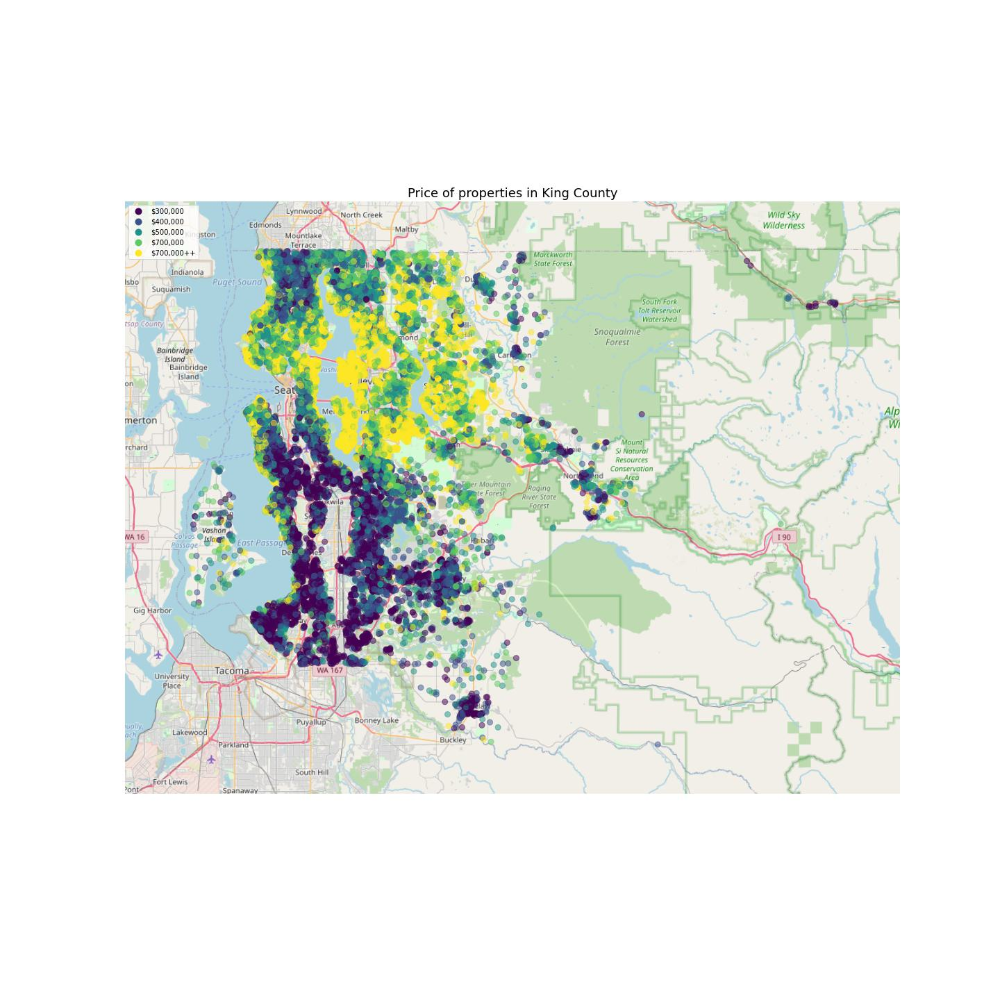
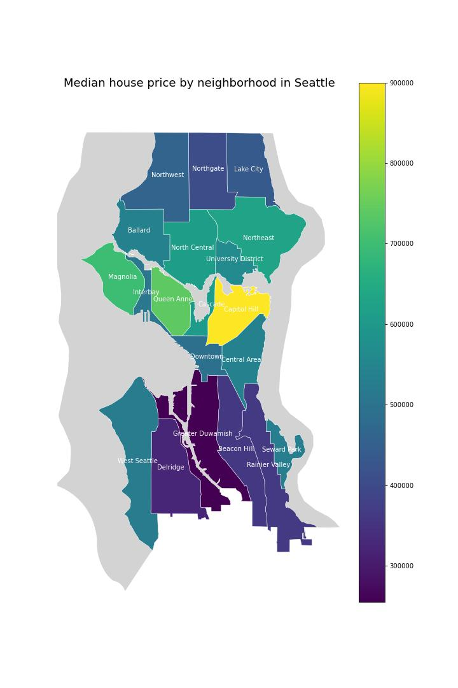
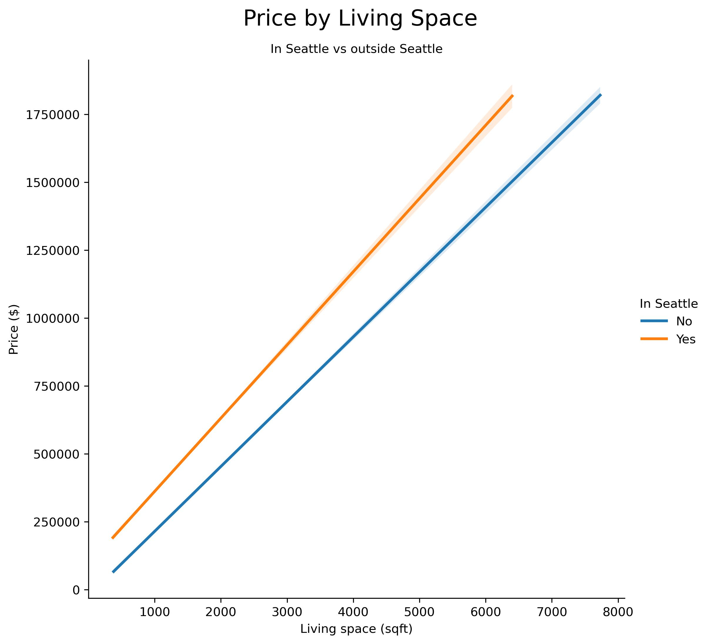
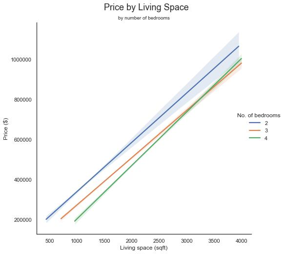
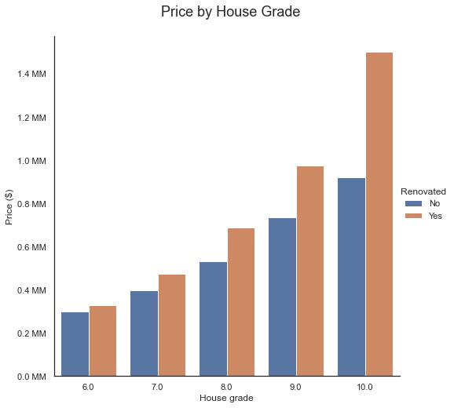
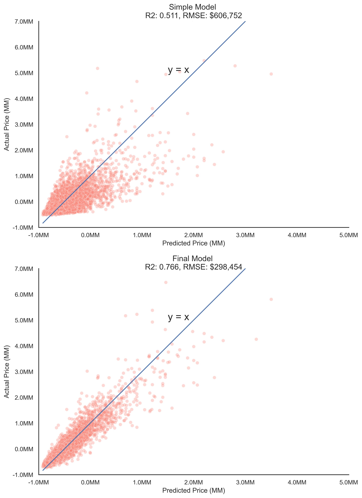

# King County Millenial homeowner program

**Buying a property in King County recommendations for Millennials**

**Authors:** [Hanis Zulmuthi](https://github.com/hanis-z), [Greg Burgess](https://github.com/gcburgess), [Kyle Weesner](https://github.com/KyleWeesner)

March 2022


## Overview
King County in Washington State is growing in population made up of Millenials and Generation Z who either grew up or migrated to the area and found life in the region. We, the Data Analysts at the Greek Honey Real Estate are working on building a model that predicts house prices in King County with the goal to help folks from the demographic to find their dream house that fits their lifestyle and their budgets!
 
## Business Problem
Housing market in King County region, especially in the major cities such as Seattle, are becoming more and more financially inaccessible for many demographics. The demographic of interest for our real-estate is millenials who are building their career, family and trying to break into the housing market to have a stable house for themselves. With our house price predicition model, we will help them to find the market value of their ideal house that are in proximity to city centers.
  
## Data 
To generate King County housing prices we used data provided to us by Flatiron School. This data file is available in the project repo in the folder "data" as well as a [file](data/column_names.md) which provides information on its corrolated column names and descriptions for King County data set in the years of 2014-2015.

Incorporated & unincorporated cities in King county we downloaded this data from [King County GIS website](https://gis-kingcounty.opendata.arcgis.com/datasets/kingcounty::cities-and-unincorporated-king-county-city-kc-area/explore?location=47.430582%2C-121.809200%2C10.02). The data is also easily accessible in our project repo in the folder "data".This dateset provided us with city boundaries of cities in king county in a shapefile along with `CITYNAME`.

Neighborhood Map of Seattle we attained this data from [Seattle city GIS website](https://data-seattlecitygis.opendata.arcgis.com/datasets/neighborhood-map-atlas-districts/explore?location=47.628714%2C-122.338313%2C11.43%5D). This data is also easily accessible in our project repo in the folder "data". This dataset provided us with neighborhood boundaries of neighborhoods in Seattle city along with neighborhood (`L_HOOD`).

## Tools
This report uses pandas for data analysis and dataframe manipulation. Sklearn for machine learning and statistical modeling. We utilized data from these sources to build a house price predictor model.

Geopandas used in python for working with geospatial data.   We are using geospatial analysis to assist the consumer in deciding where and what types of homes they should aim for.


## Results
### Location  
**Houses Sold in King County**
By using geopandas and our King County data we were able to produce a geospatial image depicting houses sold at their prices.  There are many inferences that can be made from this image such as but not limited to:
* Activity is concentrated around Seattle.  Which you can an save $14,000 per mile as you move away from Seattle when buying a house.  
* Housing Prices are highest around Lake Washington and Sammamish.  Having a waterfront house can greatly increase the house cost by $630,000.
* By having State Parks scenic views it can increase house costs by $55,000 or more.


By using geopandas and our King County data we were able to produce a geospatial image depicting median house price by neighborhood in Seattle.  There are many inferences that can be made from this image such as but not limited to:
* Living in Seattle can be seen as 3 price regions northern, central, and southern. 
* Central Seattle is the highest priced region with the most expensive neighborhoods.  Specifically, Capitol Hill being the most expensive location in Seattle with house prices costing an additional $208,000 over the median price to live in Seattle.  
* Certain neighborhoods can save you money. In southern Seattle Greater Duwamish neighborhood is lowest pricing neighborhood with saving $192,000 under the median price to live in Seattle. In Northern Seattle Northgate is a lower pricing neighborhood which values $53,000 under the median price to live in Seattle.


House price living space is affected by location if its in Seattle or not.  The median house price in Seattle is $510,000, and the median outside is $424,000.  Seattle premium can cost $90,000 more.  Additionally Living Space in King County increases by 18,000 per 100sqft.



### Modeling Results 
Considering bedrooms is another example of insights that the Millennial Homeowner Program can provide.  We found that, for similarly sized houses, adding an additional bedroom can SAVE you $15,000.  This may be because each bedroom is smaller, but knowing this could still be important for growing families


If you appreciate higher quality craftsmanship in your home, you might save by doing the work yourself.  Purchasing 'very good' quality can cost over $300,000 more than 'average' quality.  Also, recently renovated properties can cost $50,000 more, even for the same quality craftsmanship


### Modeling Performance
Ultimately, our predictive model was able to capture 76.6% of the variance on price values in a withheld test dataset. There is substantial variability in house sale prices in King County. Nonetheless, we were able to reduce errors in prediction (RMSE) from $606,752 in our baseline model to $298,454. There are likely additional changes that could be made to reduce errors in our prediction. We will explore those steps in the future.



## Conclusion
**Location, location, location:**
We can help you discover which neighborhoods will save you money.  Scenic locations can be wonderful, but may cost you substantially

**Next, Don't pay for space you don't need!**
Fitting more bedrooms in the same living space can save you money.

**If you want high-quality workmanship, consider doing work yourself.**
Higher-quality properties cost much more.  Recently renovated properties cost more, even for the same quality. 

  
## Repository Structure
  ```
├── data  
├── images
├── IndividualNotebooks  
│       ├── Hanis_notebook.ipynb
│       ├── Hanis_notebook_proper.ipynb
│       ├── initial_data_exploration_and_cleaning.ipynb
│       ├── Kyle notebook.ipynb
│       └── modeling_and_validation_notebook.ipynb
│
├── .gitignore
├── King_County_Affordable_housing.ipynb 
├── README.md
├── add_city_neighborhood.ipynb
└── geo_env.yml 
  ```
## Next Steps  
We plan to continue developing our predictive models in several ways. 
* Look into crime data to verify the safety of neighborhoods. 
* Look at proximity of properties to schools, daycare, parks, and community center.
* Look at public transportation and "walkability" scores.
